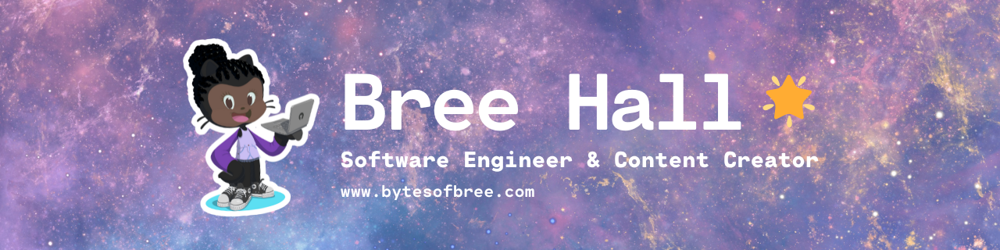
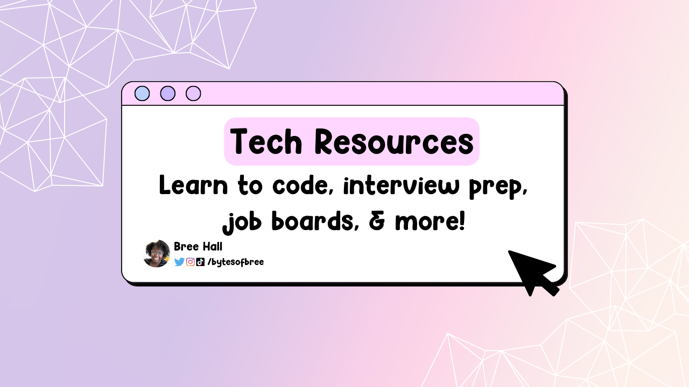
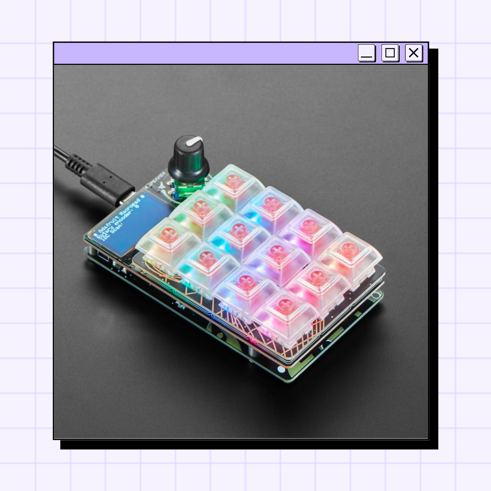

# 👋🏾 Hey, I'm Bree!

I'm a software engineer with a love for frontend web development. I'm currently working with React to create easy-to-use and beautiful web apps. I strive to make the technology industry more accessible to aspiring developers and engineers by creating content to share the mistakes I've made and lessons I've learned along my software engineering journey so far.

<table>
  <tr>
    <td align="center">
        <h3>💫 Fun Facts</h3>
        
☕️ <strong>Java</strong> was my the first programming language I learned!

        
🎮 When I'm not coding or creating content, you'll likely find me playing a video game. I'm currently playing <strong>The Legend of Zelda: Tears of the Kingdom</strong>.

        
🧁 I love baking and owned a <strong>cupcake</strong> business for a short period of time.

         
    </td>
    <td align="center">
        <h3>💻 Languages & Tools</h3>
        
    </td>
  </tr>
  <tr>
    <td align="center"> 
        <h3>📺 My Latest YouTube Video</h3>
        <a href="https://youtu.be/hLGV3gz3c7w">
            
            How to Get Developer Experience & Land Your First Job as a Software Engineer
        </a>
    </td>
    <td align="center">
        <h3>📚 My Favorite Tech Resources</h3>
        <a href="https://bytesofbree.hashnode.dev/tech-resources">
            
            Resources to assist you in learning to code, prep for technical interviews, job boards, and more!
        </a>
    </td>
   </tr> 
   <tr>
    <td>
        <h3 style="text-align: center" align="center" valign="top">📖 Currently Learning</h3> 
        <ul>
            <li>Building design skills with <strong>Figma</strong> </li>
            <li><strong>CircuitPython</strong> to program an Adafruit Macropad</li>
            <li>I'll be learning <strong>JavaScript</strong> <em>forever</em>! 😊 </li>
        </ul>
    </td>
    <td align="center">
        <h3>👷🏾‍♀️ Currently Building</h3>
        
        
I'm currently building an <a href="https://learn.adafruit.com/adafruit-macropad-rp2040/overview">Adafruit MacroPad</a> and I'll use CircuitPython to program it!
 
    </td>
  </tr>
  <tr>
    <td colspan="2" align="center"> 
        <h3>🌐 Let's Connect!</h3> 
        
        
        
        
        
        
    </td>
  </tr>
</table>
